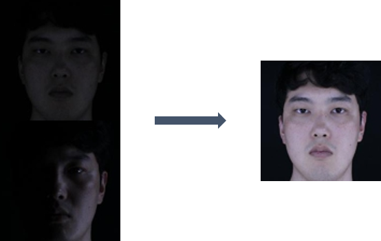
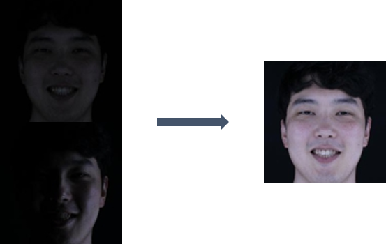

# Improved Illumination

## Task
```
For given dark input images, generate bright images
```

## Dataset
| Phase | # |
| - | - |
| train | 283,337 |
| validate | 106,331 |
| test | 9,900 |

## Image Resolution
```
112 * 112
```

## Data Directory
```
\_data
    \_ train
        \_ ??????_S001_L??_E??_C??_cropped.jpg (images)
        \_ train_labels.csv
    \_ validate
        \_ ??????_S001_L??_E??_C??_cropped.jpg (images)
        \_ validate_labels.csv
    \_ test
        \_ ??????_S001_L??_E??_C??_cropped.jpg (images)
        \_ test_labels.csv (dummy labels)

image_name = "Person"_S001_"Illumination"_"Expression"_"Camera_Angle"_cropped.jpg
```

## Data Sample
　　　
　　　


## Label
```
# train_labels.txt
17080801_S001_L10_E01_C10_cropped.jpg 17080801_S001_L2_E01_C10_cropped.jpg

(dark_image_name) (bright_image_name)
```

## Metric
```
The average of L1 Losses of each prediction-answer image pair.

L1 Loss is the average of absolute errors of each pixel value pair(between prediction and answer image)

The lights with 400 lux in every directions are illuminated in the answer images.

So we are going to evaluate using them
```

## Description
```
For given image, baseline model just applies convolutions and decovolutions generating new images that have 112 * 112 size.
```

## Commands
```
# train
python main.py --lr=0.001 --cuda=True --num_epochs=10 --print_iter=10 --prediction_dir="prediction" --batch=4 --mode="train"

# test (for submission)
python main.py --batch=4 --model_name="1.pth" --prediction_dir="prediction" --mode="test" 


All options in example commands are default value.
If you have problem with os.mkdir or shutil.rmtree in baseline code, manually remove prediction_dir and create prediction_dir
```


## Submission
```
Output image file names should be same with input image file names

Make tar.gz file of prediction folder.

tar -zcvf prediction.tar.gz prediction

Submit prediction.tar.gz
```
