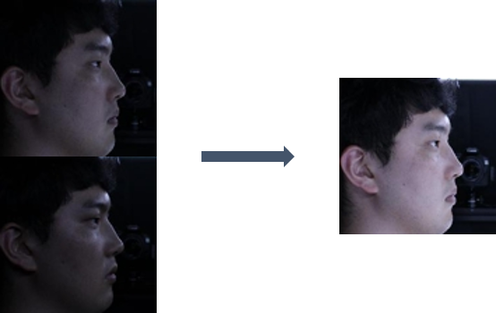
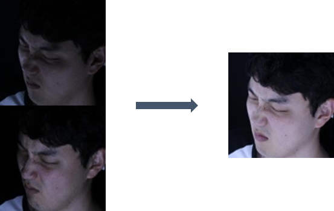

# Improved Illumination

## Task
```
For given dark input images, generate bright images
```

## Dataset
| Phase | # |
| - | - |
| train | 283,337 |
| validate | 106,331 |
| test | 105,891 |


## Data Directory
```
\_data
    \_ train
        \_ ??????_S001_L??_E??_C??_cropped.jpg (images)
        \_ train_labels.csv
    \_ validate
        \_ ??????_S001_L??_E??_C??_cropped.jpg (images)
        \_ validate_labels.csv
    \_ test
        \_ ??????_S001_L??_E??_C??_cropped.jpg (images)
        \_ test_labels.csv (dummy labels)

image_name = "Person"_S001_"Illumination"_"Expression"_"Camera_Angle"_cropped.jpg
```

## Data Sample
　　　
　　　


## Label
```
# train_labels.txt
17080801_S001_L10_E01_C10_cropped.jpg 17080801_S001_L2_E01_C10_cropped.jpg

(dark_image_name) (bright_image_name)
```

## Metric
```
The average of L1 Losses 

"bright_image_name" always has illumination code "L2"

Images that have "L2" are our answer images

So we are going to evaluate using them
```

## Description
```
For given image, baseline model just do convolutions and decovolutions generating new image that has original image size
```

## Commands
```
# train
python main.py --num_classes=38 --lr=0.001 --cuda=True --num_epochs=10 --print_iter=10 --model_name="model.pth" --prediction_dir="prediction" --batch=4 --mode="train"

# test (for submission)
python main.py --batch=4 --model_name="1.pth" --prediction_dir="prediction" --mode="test" 


All options in example commands are default value.
If you have problem with os.mkdir or shutil.rmtree in baseline code, manually remove prediction_dir and create prediction_dir
```