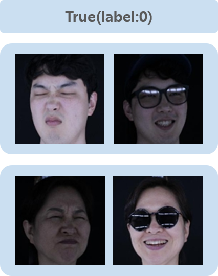

# Face Verification(Accessories) limit

## Task
```
이 문제에서는 모델 아키텍쳐에 사용 할 수 있는 파라메타가 제한됩니다. (500만개)

다양한 표정, 조명, 각도 환경에서 얼굴 이미지_1(악세사리 착용) 얼굴 이미지_2(악세사리 미착용)의 동일인 여부를 분류(True/False) 하는 문제
악세사리 : 안경(일반, 뿔테, 선글라스), 모자
표정 : 무표정, 활짝 웃음, 찡그림
조명 : 1000, 400, 200, 150, 100 Lux (전체 켜짐)
각도 : 좌우(-15, 0 , 15도) / 상하 (0도)
```

## Dataset
#### Image Resolution : 112 X 112


| Phase | none | acc | total |
| - | - | - | - |
| train | 22,050 | 110,250 | 132,300 |

```
train data로 액세서리를 착용하지 않은 이미지와 착용한 이미지를 다양하게 제공합니다. 
학습 시간 등을 고려하여 dataloader로 부터 자유롭게 로드하여 사용하시면 됩니다.
```

| Phase | True | False | total |
| - | - | - | - |
| validate | 5,000 | 5,000 | 10,000 |
| test | 10,000 | 10,000 | 20,000 |

```
validate와 test data는 액세서리를 착용하지 않은 이미지와 착용한 이미지 한 쌍을 Pair로 제공합니다.
```

## Data Directory
```
\_data
    \_ train
        \_ ??????_S???_L??_E??_C??_cropped.jpg (images)
        \_ train_meta.csv
        \_ train_label.csv
    \_ validate
        \_ ??????_S???_L??_E??_C??_cropped.jpg (images)
        \_ validate_label.csv
    \_ test
        \_ ??????_S???_L??_E??_C??_cropped.jpg (images)
        \_ test_label.csv (dummy labels)

image_name = "Person"_"Accessory"_"Illumination"_"Expression"_"Camera_Angle"_cropped.jpg
```

## Data Sample
　　　

## Label
```
# train_meta.txt
(image_name)                         (face_id) (acc_option)
18082902_S001_L5_E01_C6_cropped.jpg  18082902   none
18082902_S001_L5_E01_C6_cropped.jpg  18082902   acc

# *****_label.txt
(none_image_name)                    (acc_image_name)                    (label)
19081231_S001_L5_E02_C7_cropped.jpg  19081231_S002_L2_E01_C7_cropped.jpg  0
19081231_S001_L4_E03_C6_cropped.jpg  19090332_S005_L4_E02_C8_cropped.jpg  1

```

## Metric
```
F1 score
```

## Description
```
액세서리를 착용한 얼굴(acc) 이미지로 착용하지 않은 얼굴(none) 이미지와의 동일인 여부를 판단하는 문제입니다.
액세서리를 착용한 얼굴 1장과 착용하지 않은 얼굴 1장이 한 pair로 주어집니다.(이 때, 조명 밝기와 표정은 랜덤으로 주어짐)
label은 동일인일 때 0, 동일인이 아닐 때 1로 예측하시면 됩니다.

Baseline code는 siamese network로 모델링되어 있으며 이는 자유롭게 변경하여 작성하시면 됩니다.
train data 기준으로 만들 수 있는 최대 Pair의 수는 약 13억 쌍 정도이나 
모든 쌍을 학습에 사용하지 않고 train 실행 시 학습에 사용할 pair를 만들도록 작성되어 있습니다.
이 부분 역시 자유롭게 변경하여 사용하실 수 있습니다.
다만, 정확한 evaluation을 위해 label file 양식은 변경하실 수 없습니다.
```

## Commands
```
# train
python main.py --lr=0.001 --cuda=True --num_epochs=10 --print_iter=10 --model_name="model.pth" --prediction_dir="prediction" --batch=16 --mode="train"

# test (for submission)
python main.py --batch=16 --model_name="1.pth" --prediction_dir="prediction.txt" --mode="test" 


All options in example commands are default value.
```

## Submission
```
prediction.txt 파일을 제출하시면 됩니다.

prediction.txt 파일은 none image, acc image, label 형태입니다.
label 부분을 예측 값으로 작성하시어 제출하시면 됩니다.
```
## Notice

'''
!!!!!!!!!!!!!!!!!!!!! 필독!!!!!!!!!!!!!!!!!!!!!!!!!!!

** 컨테이너 내 기본 제공 폴더
- /datasets : read only 폴더 (각 태스크를 위한 데이터셋 제공)
- /tf/notebooks :  read/write 폴더 (참가자가 Wirte 용도로 사용할 폴더)
1. 참가자는 /datasets 폴더에 주어진 데이터셋을 적절한 폴더(/tf/notebooks) 내에 복사/압축해제 등을 진행한 뒤 사용해야합니다.
   예시> Jpyter Notebook 환경에서 압축 해제 예시 : !bash -c "unzip /datasets/objstrgzip/18_NLP_comments.zip -d /tf/notebooks/
   예시> Terminal(Vs Code) 환경에서 압축 해제 예시 : bash -c "unzip /datasets/objstrgzip/18_NLP_comments.zip -d /tf/notebooks/
   
2. 참가자는 각 문제별로 데이터를 로드하기 위해 적절한 path를 코드에 입력해야합니다. (main.py 참조)
3. 참가자는 모델의 결과 파일(Ex> prediction.txt)을 write가 가능한 폴더에 저장되도록 적절 한 path를 입력해야합니다. (main.py 참조)
4. 세션/컨테이너 등 재시작시 위에 명시된 폴더(datasets, notebooks) 외에는 삭제될 수 있으니 
   참가자는 적절한 폴더에 Dataset, Source code, 결과 파일 등을 저장한 뒤 활용해야합니다.
   
!!!!!!!!!!!!!!!!!!!!! 필독!!!!!!!!!!!!!!!!!!!!!!!!!!!
'''
