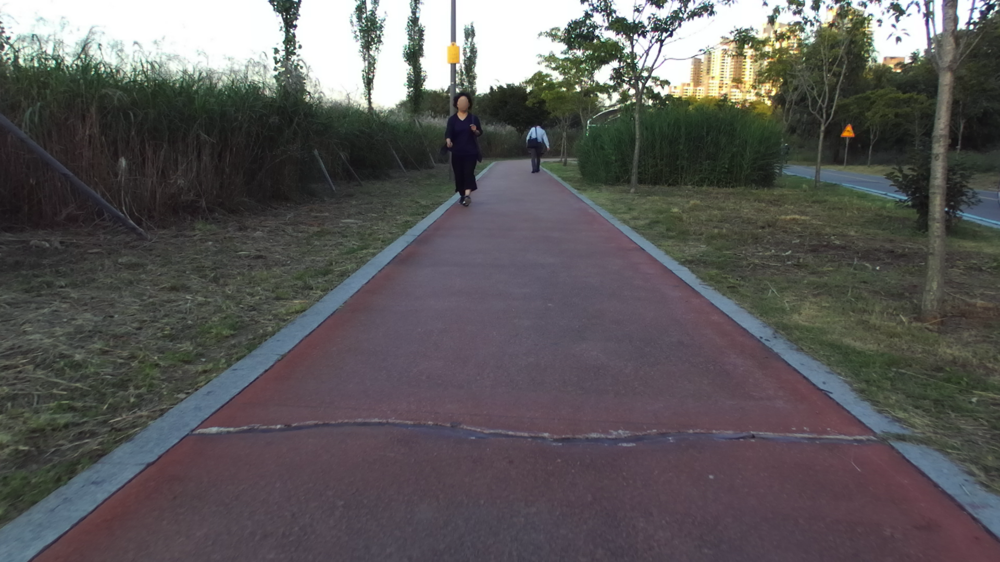
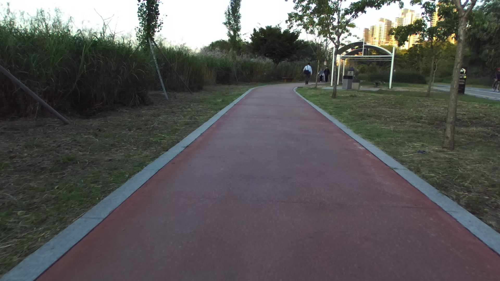
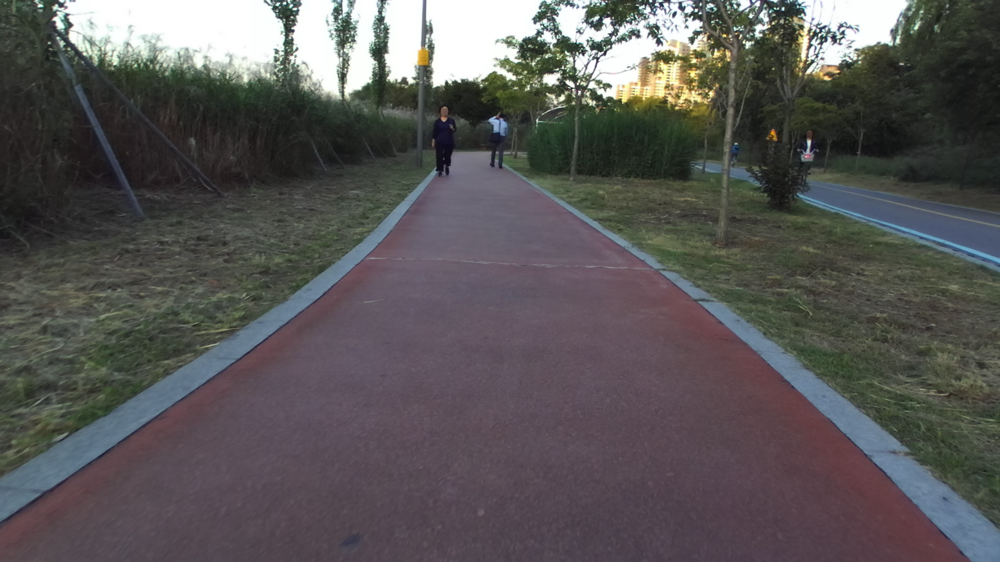
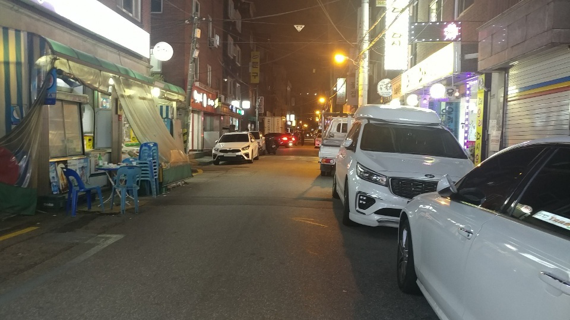

# object_detection

## Task
```
도로 사진을 입력으로, 사용자의 보행에 장애물이 될 Object를 Detection
Input : 도로 이미지
Output : 도로 이미지내의 장애물 클래스와 Confidence, 좌상단, 우한단 좌표
```
309562/22742/17411 
## Dataset

| Phase | Image | Lable |
| - | - | - |
| train | image: 309,562 | xml_file: 1 |
| validate | image: 22,742 | xml_file: 1 |
| test | image: 17,411 | xml_file: 1 |

## Data Directory
```
\_data
    \_ train
        \_ *.png or *.jpg (load_images), train.xml (Label)
    \_ val
        \_ *.png or *.jpg (load_images), val.xml (Label)
    \_ test
        \_ *.png or *.jpg (load_images), test.xml (Label)

image_name = "ZED2_KSC_071987_L_P020901.png", "MP_KSC_000001.jpg" ....
```

## Data Sample
　　　
　　　


## Label Sample
```
# val.xml

<annotations>
  <meta>
    <task>
      <size>22742</size>
      <labels>
        <label>
          <name>bus</name>
        </label>
        <label>
          <name>car</name>
        </label>
        <label>
          <name>carrier</name>
        </label>
            .
            .
            .
      </labels>
    </task>
  </meta>
  <image height="540" id="0" name="MP_SEL_269355_P023251.jpg" width="960">
    <box label="truck" occluded="1" xbr="499.35" xtl="465.17" ybr="323.42" ytl="281.655" />
    <box label="tree_trunk" occluded="0" xbr="406.2" xtl="383.705" ybr="412.92" ytl="178.84" />
    <box label="car" occluded="1" xbr="703.655" xtl="653.27" ybr="346.55" ytl="319.375" />
    <box label="truck" occluded="1" xbr="643.245" xtl="577.835" ybr="346.025" ytl="274.705" />
    <box label="car" occluded="0" xbr="340.18" xtl="261.82" ybr="347.76" ytl="295.92" />
    <box label="pole" occluded="1" xbr="892.14" xtl="825.285" ybr="536.835" ytl="0.0" />
  </image>
  <image height="540" id="1" name="MP_SEL_269360_P023252.jpg" width="960">
    <box label="person" occluded="0" xbr="670.97" xtl="623.94" ybr="403.25" ytl="269.88" />
    <box label="pole" occluded="1" xbr="50.03" xtl="6.26" ybr="384.02" ytl="0.0" />
    <box label="person" occluded="0" xbr="601.6" xtl="558.89" ybr="401.71" ytl="272.73" />
    <box label="car" occluded="1" xbr="515.74" xtl="396.87" ybr="371.71" ytl="282.94" />
  </image>
                  .
                  .
                  .
</annotations>
```

## Output Sample
```
<predictions>
  <image name="ZED2_KSC_071987_L_P020901">
    <predict class_name="person" score="0.9276292324066162" x1="935" x2="976" y1="207" y2="322" />
    <predict class_name="person" score="0.9024460911750793" x1="825" x2="878" y1="205" y2="338" />
    <predict class_name="person" score="0.8240242600440979" x1="1526" x2="1567" y1="248" y2="347" />
    <predict class_name="pole" score="0.7087787985801697" x1="797" x2="823" y1="2" y2="307" />
    <predict class_name="tree_trunk" score="0.5974036455154419" x1="1372" x2="1412" y1="238" y2="474" />
    <predict class_name="tree_trunk" score="0.3645015060901642" x1="1375" x2="1419" y1="109" y2="455" />
    <predict class_name="bicycle" score="0.17385147511959076" x1="1517" x2="1562" y1="298" y2="361" />
    <predict class_name="person" score="0.138469398021698" x1="1542" x2="1564" y1="249" y2="336" />
    <predict class_name="person" score="0.09525573253631592" x1="1523" x2="1555" y1="254" y2="329" />
    <predict class_name="tree_trunk" score="0.0740027129650116" x1="1092" x2="1117" y1="202" y2="340" />
    <predict class_name="bicycle" score="0.06778295338153839" x1="826" x2="876" y1="254" y2="342" />
    <predict class_name="bicycle" score="0.051166385412216187" x1="935" x2="974" y1="249" y2="324" />
    <predict class_name="pole" score="0.050149742513895035" x1="1373" x2="1419" y1="8" y2="493" />
  </image>
                 .
                 .
                 .
</predictions>                 
```

## Metric
```
평가를 위한 Metric : mAP(Box IoU = 0.75)

```

## Description
```
dataloader.py : img name기준 오름차순으로 xml 파일 안에 라벨 정보를 불러온 뒤 target 이라는 딕셔너리 형태로 저장, 한 이미지 tensor와 그 이미지에 대한 label이 target이라는 딕셔너리로 매칭되는 방식

model.py : torchvision 내부에 있는 FastRCNN model을 호출하여 사용
main.py : train, test 함수 구현, test의 경우 submission file 형식으로 저장됨.
evaluate.py : submission file을 통해 성능 평가
```

## Commands
```
# train
python main.py 

# test (for submission)
python main.py --num_classes=29 --model_name="1" --prediction_dir="prediction" --mode="test" 

모든 옵션은 default value가 있음
옵션은 main.py 파일 참고
```
## Reference
mAP 설명
https://medium.com/@jonathan_hui/map-mean-average-precision-for-object-detection-45c121a31173
