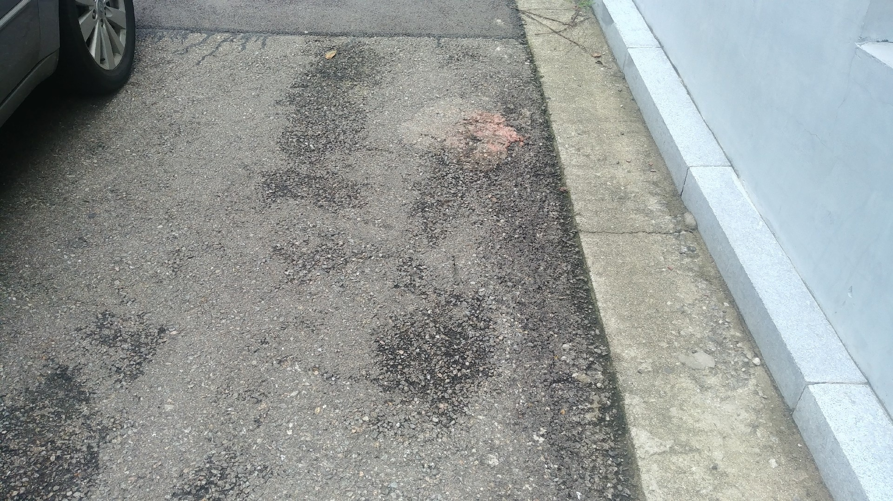
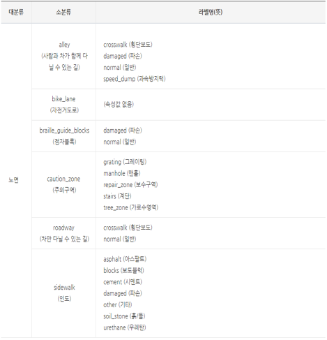

# Surface segmentation (Limit)

## Task
```
Image segmentation 노면 이미지에서 각 영역을 분할하는 문제

(모델 파라미터 수 15,000,000 (15M) 제한)
```

## Dataset
* image height = 1080, width = 1920, channel = 3


| Phase | num of image | num of mask_image | label_format |
| - | - | - | - |
| train | 32,467 | 32,467 | xml_file: 540 |
| validate |  7,028 | 7,028 | xml_file: 124 |
| test | 6,904 | 6,857 | xml_file: 136 |


## Data Directory
```
\_data
    \_ train
        \_ Surface_***
        \_ MASK, *.xml , *.jpg (images)
            \_ *.png (mask_images)
    \_ val
        \_ MASK, *.xml , *.jpg (images)
            \_ *.png (mask_images)
    \_ test
        \_ MASK, *.xml , *.jpg (images)
            \_ *.png (mask_images)

image_name = "MP_SEL_SUR_033182.jpg"
mask_image_name = "MP_SEL_SUR_033182.png"
```

## Data Sample
　　　


## class_name (21 classes)




## Evaluation

mAP(mask IoU = 0.5)

#Submission file(xml format)

***!!!주의 !!!!***

***prediction.xml 작성시 좌표값은 'image height = 1080, width = 1920' 기준으로 작성***
```
<predictions>
  <image name="MP_SEL_SUR_000001">
    <predict class_name="sidewalk_cement" polygon="1344,949;1344,952;1343,953;1343,959;1344,960;1345,959;1345,955;1344,954;" score="0.09568093717098236" />
    <predict class_name="alley_damaged" polygon="716,964;715,965;714,965;717,965;718,966;720,966;721,965;728,965;725,965;724,964;" score="0.06147599592804909" />
  </image>
  <image name="MP_SEL_SUR_000002">
    <predict class_name="caution_zone_tree_zone" polygon="1064,38;1062,40;1062,45;1063,46;1063,47;1066,50;1066,52;1068,54;1068,56;1071,59;1071,61;1072,62;1072,65;1073,66;1073,73;1074,74;1074,78;1075,79;1075,81;1076,82;1076,84;1078,86;1078,88;1079,88;1080,89;1081,89;1082,90;1241,90;1242,89;1245,89;1246,88;1247,88;1247,87;1248,86;1248,84;1247,83;1247,82;1245,80;1245,78;1243,76;1243,75;1242,75;1240,73;1240,72;1239,71;1239,70;1238,69;1238,68;1234,64;1233,64;1232,63;1232,62;1231,61;1231,60;1229,58;1228,58;1224,54;1224,53;1223,53;1221,51;1220,51;1219,50;1218,50;1217,49;1214,49;1213,48;1209,48;1208,47;1198,47;1197,48;1195,48;1194,49;1193,49;1192,50;1191,50;1191,51;1190,52;1190,60;1189,61;1189,62;1187,64;1184,64;1183,65;1178,65;1177,66;1170,66;1169,65;1158,65;1157,66;1148,66;1147,65;1142,65;1141,64;1138,64;1137,63;1136,63;1135,62;1133,62;1132,61;1132,60;1131,59;1131,47;1132,46;1132,45;1133,44;1133,42;1132,42;1131,41;1128,41;1127,40;1119,40;1118,39;1110,39;1109,38;" score="0.9982360601425171" />
 </image>
 ...
 ...
</predictions>

```

## Description
```
dataloader.py : img name으로 xml 파일 안에 라벨 정보를 불러온 뒤 target 이라는 딕셔너리 형태로 저장, 한 이미지 tensor와 그 이미지에 대한 label이 target이라는 딕셔너리로 매칭되는 방식

model.py : torchvision 내부에 있는 MaskRCNN model을 호출하여 사용
main.py : train, test 함수 구현, test의 경우 submission file 형식으로 저장됨.
evaluate.py : submission file을 통해 성능 평가
```

## Commands
```
# train
python main.py --num_classes=38 --lr=0.001 --cuda=True --num_epochs=10 --print_iter=10 --model_name="model.pth" --batch=16 --mode="train"

# test (for submission)
python main.py --batch=4 --model_name="1.pth" --prediction_file="prediction" --mode="test" 

```
## reference

[TORCHVISION OBJECT DETECTION FINETUNING TUTORIAL][1]

[1]: https://pytorch.org/tutorials/intermediate/torchvision_tutorial.html

## Notice

'''
!!!!!!!!!!!!!!!!!!!!! 필독!!!!!!!!!!!!!!!!!!!!!!!!!!!

** 컨테이너 내 기본 제공 폴더
- /datasets : read only 폴더 (각 태스크를 위한 데이터셋 제공)
- /tf/notebooks :  read/write 폴더 (참가자가 Wirte 용도로 사용할 폴더)
1. 참가자는 /datasets 폴더에 주어진 데이터셋을 적절한 폴더(/tf/notebooks) 내에 복사/압축해제 등을 진행한 뒤 사용해야합니다.
   예시> Jpyter Notebook 환경에서 압축 해제 예시 : !bash -c "unzip /datasets/objstrgzip/18_NLP_comments.zip -d /tf/notebooks/
   예시> Terminal(Vs Code) 환경에서 압축 해제 예시 : bash -c "unzip /datasets/objstrgzip/18_NLP_comments.zip -d /tf/notebooks/
   
2. 참가자는 각 문제별로 데이터를 로드하기 위해 적절한 path를 코드에 입력해야합니다. (main.py 참조)
3. 참가자는 모델의 결과 파일(Ex> prediction.txt)을 write가 가능한 폴더에 저장되도록 적절 한 path를 입력해야합니다. (main.py 참조)
4. 세션/컨테이너 등 재시작시 위에 명시된 폴더(datasets, notebooks) 외에는 삭제될 수 있으니 
   참가자는 적절한 폴더에 Dataset, Source code, 결과 파일 등을 저장한 뒤 활용해야합니다.
   
!!!!!!!!!!!!!!!!!!!!! 필독!!!!!!!!!!!!!!!!!!!!!!!!!!!
'''
