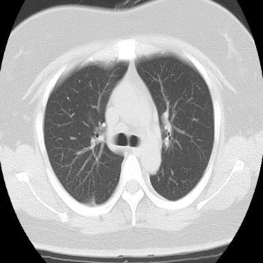
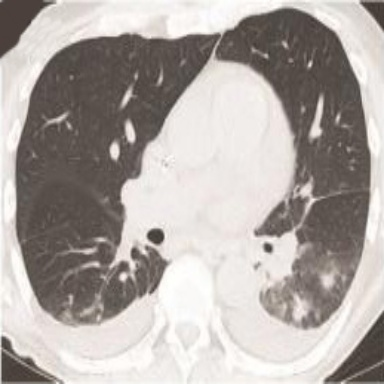
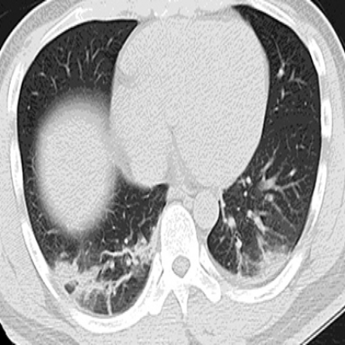

# Classification_COVID

## Task
환자의 흉부 CT 이미지를 입력으로, 환자의 COVID 양성/음성 이진 분류 \
Input : 흉부 CT 이미지(384x384x3) \
Output : COVID 양성/음성

## Dataset
| Phase | # |
| - | - |
| train | 546 |
| validate | 100 |
| test | 100 |


## Data Directory
```
\_data
    \_ train
        \_ 0.png , 1.png, 2.png ..., train_label_COVID.txt and train_label_COVID.xlsx
    \_ validate
        \_ 0.png , 1.png, 2.png ..., validate_label_COVID.txt and validate_label_COVID.xlsx
    \_ test
        \_ 0.png , 1.png, 2.png ..., test_label_COVID.txt and test_label_COVID.xlsx        

```

## Data Sample
 음성_1 (384x384x3)                                 
 양성_1 (384x384x3)    
 음성_2 (384x384x3)                                
 양성_2 (384x384x3)   


## Label Sample
```
# train_label_COVID.txt
0.png 0
1.png 1
2.png 0
3.png 1
4.png 1
5.png 1
...
# train_label_COVID.xlsx
0.png	0
1.png	1
2.png	0
3.png	1
4.png	1

```
## Metric
```
평가를 위한 Metric : Accuracy
```

## Commands
```
# train
python main.py 

# test (for submission)
python main.py --batch=4 --mode="test" --model_name 1.pth

모든 옵션은 default value가 있음
옵션은 main.py 파일 참고
```

## Notice

'''
!!!!!!!!!!!!!!!!!!!!! 필독!!!!!!!!!!!!!!!!!!!!!!!!!!!

** 컨테이너 내 기본 제공 폴더
- /datasets : read only 폴더 (각 태스크를 위한 데이터셋 제공)
- /tf/notebooks :  read/write 폴더 (참가자가 Wirte 용도로 사용할 폴더)
1. 참가자는 /datasets 폴더에 주어진 데이터셋을 적절한 폴더(/tf/notebooks) 내에 복사/압축해제 등을 진행한 뒤 사용해야합니다.
   예시> Jpyter Notebook 환경에서 압축 해제 예시 : !bash -c "unzip /datasets/objstrgzip/18_NLP_comments.zip -d /tf/notebooks/
   예시> Terminal(Vs Code) 환경에서 압축 해제 예시 : bash -c "unzip /datasets/objstrgzip/18_NLP_comments.zip -d /tf/notebooks/
   
2. 참가자는 각 문제별로 데이터를 로드하기 위해 적절한 path를 코드에 입력해야합니다. (main.py 참조)
3. 참가자는 모델의 결과 파일(Ex> prediction.txt)을 write가 가능한 폴더에 저장되도록 적절 한 path를 입력해야합니다. (main.py 참조)
4. 세션/컨테이너 등 재시작시 위에 명시된 폴더(datasets, notebooks) 외에는 삭제될 수 있으니 
   참가자는 적절한 폴더에 Dataset, Source code, 결과 파일 등을 저장한 뒤 활용해야합니다.
   
!!!!!!!!!!!!!!!!!!!!! 필독!!!!!!!!!!!!!!!!!!!!!!!!!!!
'''
