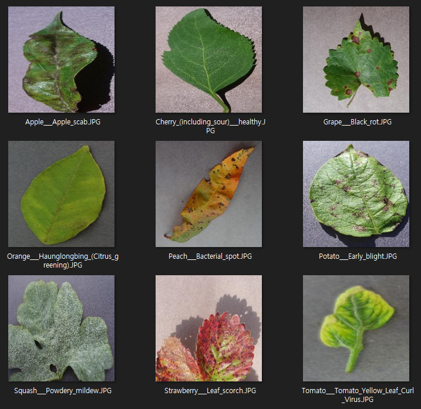
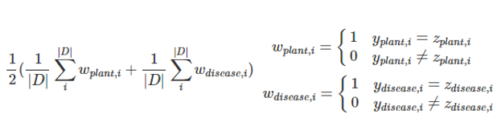

# Classfication Plants (Multi-Label Classification)

## Task
```
For given input images, predict plant and disease (Multi Labels)
```

## Dataset
| Phase | # |
| - | - |
| train | 38,013 |
| validate | 8,146 |
| test | 8,147 |

## Image Resolution
```
256 * 256
```


## Data Directory
```
\_data
    \_ train
        \_ *.jpg (images)
        \_ train_labels.txt
    \_ validate
        \_ *.jpg (images)
        \_ validate_labels.txt
    \_ test
        \_ *.jpg (images)
        \_ test_labels.txt (dummy labels)
```

## Data Sample


## Data Sample


## Label
```
# train_labels.txt

cd7bc55c-1c47-4af7-9875-f29147d54115___FREC_Scab_3471.JPG 0 0

(File_name) (Plant_Label) (Disease_Label)
```


## Metric
```
The average of Custom Hamming Loss for plants and Custom Hamming Loss for deseases

Below is the expression

(D is the set of data)
```



## Description
```
The prediction file should include 2 labels distinguished by whitespace like label files line by line. 

The Baseline model doesn't predict 'plant and disease labels' seperately, but 'plant with disease'(combined) label like solving single-label problem. 

So baseline code provides conversion dictonary and function(single-label to multi-label, multi-label to single-label)

Therefore loss function in baseline code also use single combined label as parameter

ex) 
(Grape, Black_rot) = (4, 2) -> Grape___Black_rot = 11
```


## Commands
```
# train
python main.py --num_classes=38 --lr=0.001 --cuda=True --num_epochs=10 --print_iter=10 --prediction_file="prediction.txt" --batch=4 --mode="train"

# test (for submission)
python main.py --batch=4 --model_name="1.pth" --prediction_file="prediction.txt" --mode="test"


All options in example commands are default value.
And Maybe should modify code about "num_classes" for your own multi-label prediction models.
```


## Submission
```
Submit your prediction.txt

The format of each line in text file is "filename plant_label disease_label"

ex) filename.JPG 9 15
```


## Dictonary of Labels

### Combined Labels
| Plant___Disease | Class |
| - | :-: |
|Apple___Apple_scab|0|
|Apple___Black_rot|1|
|Apple___Cedar_apple_rust|2|
|Apple___healthy|3|
|Blueberry___healthy|4|
|Cherry_(including_sour)___Powdery_mildew|5|
|Cherry_(including_sour)___healthy|6|
|Corn_(maize)___Cercospora_leaf_spot_Gray_leaf_spot|7|
|Corn_(maize)___Common_rust_|8|
|Corn_(maize)___Northern_Leaf_Blight|9|
|Corn_(maize)___healthy|10|
|Grape___Black_rot|11|
|Grape___Esca_(Black_Measles)|12|
|Grape___Leaf_blight_(Isariopsis_Leaf_Spot)|13|
|Grape___healthy|14|
|Orange___Haunglongbing_(Citrus_greening)|15|
|Peach___Bacterial_spot|16|
|Peach___healthy|17|
|Pepper,_bell___Bacterial_spot|18|
|Pepper,_bell___healthy|19|
|Potato___Early_blight|20|
|Potato___Late_blight|21|
|Potato___healthy|22|
|Raspberry___healthy|23|
|Soybean___healthy|24|
|Squash___Powdery_mildew|25|
|Strawberry___Leaf_scorch|26|
|Strawberry___healthy|27|
|Tomato___Bacterial_spot|28|
|Tomato___Early_blight|29|
|Tomato___Late_blight|30|
|Tomato___Leaf_Mold|31|
|Tomato___Septoria_leaf_spot|32|
|Tomato___Spider_mites_Two-spotted_spider_mite|33|
|Tomato___Target_Spot|34|
|Tomato___Tomato_Yellow_Leaf_Curl_Virus|35|
|Tomato___Tomato_mosaic_virus|36|
|Tomato___healthy|37|


### Plant Labels
| Plant | Class |
| - | :-: |
|Apple|0|
|Blueberry|1|
|Cherry_(including_sour)|2|
|Corn_(maize)|3|
|Grape|4|
|Orange|5|
|Peach|6|
|Pepper,_bell|7|
|Potato|8|
|Raspberry|9|
|Soybean|10|
|Squash|11|
|Strawberry|12|
|Tomato|13|


### Disease Labels
| Disease | Class |
| - | :-: |
|Apple_scab|0|
|Bacterial_spot|1|
|Black_rot|2|
|Cedar_apple_rust|3|
|Cercospora_leaf_spot_Gray_leaf_spot|4|
|Common_rust_|5|
|Early_blight|6|
|Esca_(Black_Measles)|7|
|Haunglongbing_(Citrus_greening)|8|
|Late_blight|9|
|Leaf_Mold|10|
|Leaf_blight_(Isariopsis_Leaf_Spot)|11|
|Leaf_scorch|12|
|Northern_Leaf_Blight|13|
|Powdery_mildew|14|
|Septoria_leaf_spot|15|
|Spider_mites_Two-spotted_spider_mite|16|
|Target_Spot|17|
|Tomato_Yellow_Leaf_Curl_Virus|18|
|Tomato_mosaic_virus|19|
|healthy|20|


```
!!!!!!!!!!!!!!!!!!!!! 필독!!!!!!!!!!!!!!!!!!!!!!!!!!!
** 컨테이너 내 기본 제공 폴더
- /datasets : read only 폴더 (각 태스크를 위한 데이터셋 제공)
- /tf/notebooks :  read/write 폴더 (참가자가 Wirte 용도로 사용할 폴더)
1. 참가자는 /datasets 폴더에 주어진 데이터셋을 적절한 폴더(/tf/notebooks) 내에 복사/압축해제 등을 진행한 뒤 사용해야합니다.
   예시> Jpyter Notebook 환경에서 압축 해제 예시 : !bash -c "unzip /datasets/objstrgzip/18_NLP_comments.zip -d /tf/notebooks/
   예시> Terminal(Vs Code) 환경에서 압축 해제 예시 : bash -c "unzip /datasets/objstrgzip/18_NLP_comments.zip -d /tf/notebooks/
   
2. 참가자는 각 문제별로 데이터를 로드하기 위해 적절한 path를 코드에 입력해야합니다. (main.py 참조)
3. 참가자는 모델의 결과 파일(Ex> prediction.txt)을 write가 가능한 폴더에 저장되도록 적절 한 path를 입력해야합니다. (main.py 참조)
4. 세션/컨테이너 등 재시작시 위에 명시된 폴더(datasets, notebooks) 외에는 삭제될 수 있으니 
   참가자는 적절한 폴더에 Dataset, Source code, 결과 파일 등을 저장한 뒤 활용해야합니다.
   
!!!!!!!!!!!!!!!!!!!!! 필독!!!!!!!!!!!!!!!!!!!!!!!!!!!
```
