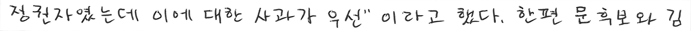
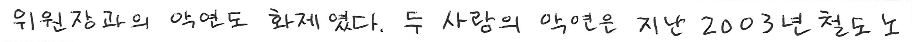
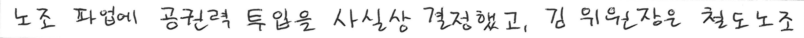

# 13_OCR_handwriting

## Task
```
주어진 이미지에 무슨 문장이 적혀있는지 맟히면 됩니다.
```

## Dataset
| Phase | Image | Label|
| - | - | - |
| train | 36,961 | 1 |
| validate | 7,920 | 1 |
| test | 7,919 | 1 |


## Data Directory
```
\_data
    \_ train
        \_ *.png (sentence_images), train.json (Label)
    \_ val
        \_ *.png (sentence_images), val.json (Label)
    \_ test
        \_ *.png (sentence_images), test.json (Label)
```

## Data Sample
　　　
　　　


## Label Sample
```
{
  "annotations": [
    {
      "width": 3740,
      "height": 176,
      "file_name": "00000010.png",
      "text": "근 노동현안에 대해 변화하는 만큼 믿고 지켜볼 것\"이라고 말했다. 한"
    },
    {
      "width": 3736,
      "height": 178,
      "file_name": "00000035.png",
      "text": "시장에 뛰어들었다. 한국야쿠르트는 소수의 고객에게만 판매하는 '내"
    },
           .
           .
           .
}
```


## Output Sample
```
{
  "predict": [
    {
      "image_path": "./data/val/00000010.png",
      "prediction": "Sample"
    },
    {
      "image_path": "./data/val/00000035.png",
      "prediction": "예시"
    },
        .
        .
        .
}
```


## Metric
```
각 문장별로 Error Rate를 검사하는 
WER(Word Error Rate)를 사용했습니다.
```


## Commands
```
# train
python main.py 

# test (for submission)
python main.py --model_name="1.pth" --prediction_dir="prediction" --mode="test" 

모든 옵션은 default value가 있음
옵션은 main.py 파일 참고
```
