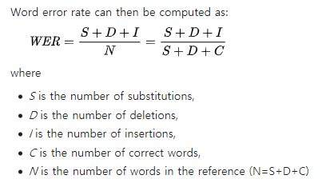

# MRC Q&A

## Task
```
주어진 본문에서 질문에 대한 답을 찾으면 됩니다.
```

## Dataset
### 본문의 수
| Phase | # |
| - | - |
| train | 33,119 |
| validate | 7097 |
| test | 7098 |


### 질문&답변 수
| Phase | # |
| - | - |
| train | 170,609 |
| validate | 36,368 |
| test | 36,448 |


## Data Directory
```
\_data
    \_ train.json
    \_ validate.json
    \_ test.json
    \_ vocab.json
```


## Data Sample
```
{
    "title": "649",
    "paragraphs": [
        {
            "context": "[OSEN=강서정 기자] 걸그룹 우주소녀의 성소가 ‘설특집 2018 아이돌 육상·볼링·양궁·리듬체조·에어로빅 선수권 대회’(이하 아육대) 출연 소감을 전했다.성소는 15일 우주소녀 공식 인스타그램에 “먼저 설날 여러분 새해 복 많이 받으세요~ 이번 설날 ‘아육대’에서 오랜만에 리듬체조도 하게 되었는데 저한테 기대 많이 했는데 이번에 좀 실망을 드린 것 같아요. 그래도 이번에 즐기면서 재밌게 했어요. 너무 좋은 추억이 되었어요!”라는 글을 게재했다.이어 “항상 하면서 좋은 언니, 동생, 친구 만날 수 있고 선생님도 뵐 수 있었고! 저와 2년 동안 함께 고생하셨던 선생님 그리고 이번에 함께 하셨던 선수 분들 고생 많았어요! 너무 축하하고 모두모두 설날 해피!! 우리 팬분들도 걱정 많이 하셨는데 너무 걱정 안해도 돼요 이제. 우정 너무 고마워요”라고 고마운 마음을 전했다.성소는 이날 방송된 MBC ‘아육대’ 리듬체조 경기에 출전했다. 원조 ‘리듬체조 여신’ 성소가 이번에도 기대를 모았는데 발레경력 7년의 에이프릴의 레이첼이 완벽한 경기를 선보이며 성소를 제치고 우승했다. /kangsj@osen.co.kr[사진] 우주소녀 인스타그램",
            "qas": [
                {
                    "question": "걸그룹 우주소녀의 성소가 이 프로그램에 출연해 리듬체조 경기에 출전했는데, 이 프로그램의 이름은?",
                    "answers": [
                        {
                            "answer_start": 450,
                            "text": "아육대"
                        }
                    ],
                    "id": "m5_306497-1",
                    "classtype": "work_who"
                }
            ]
        }
    ],
    "source": 6
},
```


## Metric
```
Word Error Rate (WER)

띄어쓰기 단위로 분리한 정답과 예측값의 sequence를 비교하여 insertions(I), deletions(D), substitutions(S)를 구한 뒤 아래와 같은 식을 적용합니다.

맞춘 단어의 수를 C라고 했을 때, N은 C + S + D입니다.

자세한 설명은 evaluation 코드와 https://en.wikipedia.org/wiki/Word_error_rate 를 참고하시면 됩니다.
```


## Description
```
data 폴더의 vocab.json은 train.json의 본문들을 scikit-learn 라이브러리의 CountVectorizer를 이용하여 제작한 vocabulary입니다. 

vocab.json 을 사용하지 않고 직접 만드셔도 됩니다.

Baseline 코드에서는 본문과 질문을 vocab.json을 이용해 길이 128의 sequence로 만들어 모델의 input으로 사용합니다.

Baseline 모델은 Linear Layer 하나로 구성되어 있으며, 결과는 2개의 output(본문에서 answer의 start index와 end index)로 출력됩니다.

prediction.json의 포맷은 Baseline 코드를 실행시키시면 확인하실 수 있습니다.

Baseline에서 제공되는 코드는 MRC를 위한 간단한 흐름만이 구현되어 있기 때문에, 제대로 동작할 수 있도록 코드를 수정하셔야 합니다.
```


## Commands
```
# train
python main.py --lr=0.001 --cuda=True --num_epochs=10 --print_iter=10 --prediction_file="prediction.json" --batch=4 --mode="train"

# test (for submission)
python main.py --batch=4 --model_name="1.pth" --prediction_file="prediction.json" --mode="test" 


예시 커맨드에 있는 값은 모두 기본값입니다.
```


## Submission
```
prediction.json을 제출하시면 됩니다.

prediction.json은 {"id": "answer_string", "id": "answer_string", ...} 형태입니다.
```