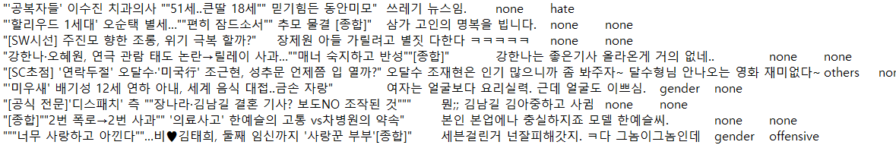
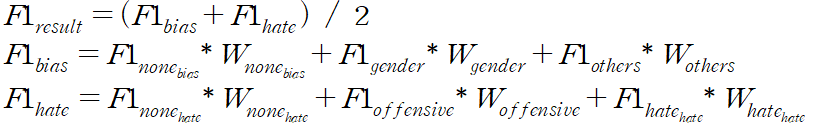

# NLP_comments

## Task
```
인터넷 뉴스 제목과 댓글 데이터로, 해당 댓글의 편향, 혐오를 분류하는 문제
Input : Title, Comment
Output : Bias(Gender, Other, None), Hate(Hate, Offensive, None)
```

## Dataset
| Phase | # |
| - | - |
| train | 7,867 |
| validate | 500 |
| test | 511 |

## Data Directory
```
\_data
    \_ train.txt
    \_ validate.txt
    \_ test.txt
```


## Data Sample


```
(title)  (comment)  (bias)  (hate) 

각 Line의 데이터는 Tab(\t)을 구분자로 사용

각 카테고리(bias, hate)는 3개의 클래스로 분류
Bias : Gender, Other, None
Hate : Hate, Offensive, None
```

## Metric
```
각 카테고리(Bias, Hate)의 Weighted F1 산출 후 산술 평균
```


## Description
```
[data label 관련]
※ Bias
 - Gender : 성적 지향성, 성 정체성, 성별에 따른 역할이나 능력에 대한 편견
 - Others : 성별 외 인종이나 출신 지역, 피부색, 종교, 장애, 직업 등에 대한 편견
 - None : 편견 존재하지 않음
 
※ Hate
 - Hate : 대상을 심하게 비난하거나 깎아내려서 정신적인 고통 등을 야기할 수 있는 표현
 - Offensive : 모욕이나 혐오에는 미치지 않지만 공격적이고 무례한 내용
 - None : 모욕이나 공격성 존재하지 않음
 
※ 이외 labeling에 대한 상세 사항 : https://www.notion.so/c1ecb7cc52d446cc93d928d172ef8442

[vocab 관련]
dataloader의 make_vocab 함수에는 sklearn의 CountVectorizer 기능을 활용하여 간단히 vocab을 생성하도록 구현되어 있습니다.
해당 로직은 자유롭게 변경하여 작성하시면 됩니다.

[class 관련]
baseline code에서는 bias와 hate 유형 각 3종을 9개의 클래스로 분류하여 예측하였습니다.
해당 로직 또한 하나의 예시일 뿐 자유롭게 변경하여 작성하시면 됩니다.

[model save 관련]
train 10 epochs 마다 저장되도록 구현되어 있습니다. 자유롭게 변경하셔도 됩니다.
```


## Commands
```
# train
python main.py --lr=0.001 --cuda=True --num_epochs=10 --print_iter=300 --model_name="model.pth" --prediction_file="prediction.txt" --batch=4 --mode="train" --num_classes 9

# test (for submission)
python main.py --batch=4 --model_name="10.pth" --prediction_file="prediction.txt" --mode="test" 


예시 커맨드에 있는 값은 모두 기본값입니다.
```

## Submission
```
prediction.txt 파일을 제출하시면 됩니다.

prediction.txt 파일은 Title, Comment, Bias, Hate 형태입니다.
Bias, Hate 부분을 예측 값으로 작성하시어 제출하시면 됩니다.
```

## Materials
```
Baseline 코드에 기본적인 모델도 들어가 있지 않기 때문에, 참고할 만한 자료들의 링크를 제공합니다.


BERT

https://github.com/google-research/bert


Ai NLP Challenge

https://challenge.enliple.com/

https://github.com/enlipleai/kor_pretrain_LM


HanBert

https://twoblockai.com/2020/01/22/hanbert%EB%A5%BC-%EA%B3%B5%EA%B0%9C%ED%95%A9%EB%8B%88%EB%8B%A4/


Pytorch Transformers

https://pytorch.org/hub/huggingface_pytorch-transformers/

https://github.com/huggingface/transformers
```

## Data Source
```
n  J. Moon*, W. I. Cho*, J. Lee, “BEEP! Korean Corpus of Online News Comments for Toxic Speech Detection,” in Proc. SocialNLP @ ACL, Jul. 2020 (to be appeared).
```


```
!!!!!!!!!!!!!!!!!!!!! 필독!!!!!!!!!!!!!!!!!!!!!!!!!!!
** 컨테이너 내 기본 제공 폴더
- /datasets : read only 폴더 (각 태스크를 위한 데이터셋 제공)
- /tf/notebooks :  read/write 폴더 (참가자가 Wirte 용도로 사용할 폴더)
1. 참가자는 /datasets 폴더에 주어진 데이터셋을 적절한 폴더(/tf/notebooks) 내에 복사/압축해제 등을 진행한 뒤 사용해야합니다.
   예시> Jpyter Notebook 환경에서 압축 해제 예시 : !bash -c "unzip /datasets/objstrgzip/18_NLP_comments.zip -d /tf/notebooks/
   예시> Terminal(Vs Code) 환경에서 압축 해제 예시 : bash -c "unzip /datasets/objstrgzip/18_NLP_comments.zip -d /tf/notebooks/
   
2. 참가자는 각 문제별로 데이터를 로드하기 위해 적절한 path를 코드에 입력해야합니다. (main.py 참조)
3. 참가자는 모델의 결과 파일(Ex> prediction.txt)을 write가 가능한 폴더에 저장되도록 적절 한 path를 입력해야합니다. (main.py 참조)
4. 세션/컨테이너 등 재시작시 위에 명시된 폴더(datasets, notebooks) 외에는 삭제될 수 있으니 
   참가자는 적절한 폴더에 Dataset, Source code, 결과 파일 등을 저장한 뒤 활용해야합니다.
   
!!!!!!!!!!!!!!!!!!!!! 필독!!!!!!!!!!!!!!!!!!!!!!!!!!!
```
