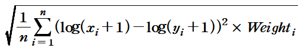

# Forecast_proton

## Task
```
태양관측위성으로 수집되는 데이터를 바탕으로 태양입자유입(Proton Flux) 양상 예측 문제

Input : SWE, EPM, X-ray 
Output : Proton
```
## Description
```
- 고에너지 입자는 태양의 플레어, 코로나 등에 의해 방출되며, 수 시간 ~ 수 일 이내에 지구에 도달
- 고에너지 입자 방출로 인해 지구로 유입되는 양성자(Proton Flux)가 증가하면 위성장애, 극지역 HF통신 및 항법시스템 장애 등을 야기함 
- X-ray는 플레어와 관련되어 있으며, SWE, EPM은 코로나와 관련되어 있으며, 양성자(Proton Flux)의 변화와 관련성이 있음
  (데이터 관측 순서 : X-ray > Proton flux > EPM, SWE ) 
- Proton : 지구 정지궤도에 있는 미국 GOES 위성에서 관측된 10MeV 이상 Proton flux의 5분 평균값
- X-ray : 지구 정지궤도에 있는 미국 GOES 위성에서 관측된 x-ray의 1분 평균값
- SWE : 지구에서 태양방향으로 150만 km 떨어진 위치의 ACE 위성에서 관측된, 태양에서 불어오는 태양풍의 밀도와 속도의 1분 평균값
- EPM : 지구에서 태양방향으로 150만 km 떨어진 위치의 ACE 위성에서 관측된, 코로나물질방출에 의해 생성되는 고에너지 양성자와 전자 밀도의 5분 평균값
  (에너지 크기별 8개로 나뉘어 측정(0.047~0.066MeV, ~0.114MeV, ~0.190MeV, ~0.310MeV, ~0.580MeV, ~1.05MeV, ~1.89MeV, ~4.75MeV ))
- 양성자의 Traval Time은 태양 플레어, 코로나물질방출의 발생 위치, 방향 등에 따라 유동적임
- 각 관측 데이터는 수집 주기(Time Step)가 다름 (Proton : 5분 / x-ray : 1분 / SWE : 약 1분 / EPM : 약 5분)
- SWE와 EPM은 수집주기가 다소 변동적임
- Input Data(X-ray, SWE, EPM) 중 -100은 위성의 고장으로 인해 해당 데이터가 관측이 되지 않았다는 메세지임. 
  (Baseline에서는 임의로 0으로 변환합니다. 해당 Empty Cell의 데이터를 추정, 예측하여 Output에 반영하는 것 또한 참가자의 Skill로 합니다.)
- Output Data(Proton) 중 -100은 위성의 고장으로 인해 해당 데이터가 관측이 되지 않았다는 메시지입니다. 
  (Baseline에서 해당 Step은 Train에서 제외됩니다. 해당 Empty Cell의 데이터를 추정, 예측하여 Output에 반영하는 것 또한 참가자의 Skill로 합니다.)
  - Output Data(Proton) 중 -100은 위성의 고장으로 인해 해당 데이터가 관측이 되지 않았다는 메시지입니다. 따라서 해당 Step은 평가에서 제외됩니다.

태양으로부터 관측되는 데이터는 매 사건마다 Traval Time이 다를 수 있어 관측되기 까지의 시간/ 혹은 영향을 주는 기간이 다를 수 있으며, 
각 데이터의 관측 주기도 다르니 참고바랍니다.
```


## Dataset
| Phase | 기간 | Solar Proton Events |
| - | - | - |
| train | 1998/02/04 ~ 2005/09/10 | 88 |
| validate | 2005/09/11 ~ 2012/07/11 | 18 |
| test | 2012/07/12 ~ 2017/12/31 | 26 |

※ 참고 : https://umbra.nascom.nasa.gov/SEP/ (Solar Proton Events Affecting the Earth Environment)


## Data Directory
```
\_data
    \_ train
        \_ train_AC_H0_SWE.csv, train_AC_H1_EPM.csv, train_proton.csv, train_xray.csv
    \_ validate
        \_ val_AC_H0_SWE.csv, val_AC_H1_EPM.csv, val_proton.csv, val_xray.csv
    \_ test
        \_ test_AC_H0_SWE.csv, test_AC_H1_EPM.csv, test_proton.csv, test_xray.csv

```

## Data Sample
### SWE
```
time_tag	                H_DENSITY_#/cc	SW_H_SPEED_km/s
2005-09-11T00:00:53.000Z	    -100	        -100
2005-09-11T00:01:57.000Z	    -100	        -100
                            .
                            .
2007-02-14T19:03:06.000Z	    2.8289	        674.1
2007-02-14T19:04:10.000Z	    3.1459	        669.26
```

### EPM
```
time_tag	P1P_.047-.066MEV_IONS_1/(cm**2-s-sr-MeV) ... P8P_1.89-4.75MEV_IONS_1/(cm**2-s-sr-MeV)
2005-09-11T00:01:00.000Z	152870	48966	33411	23198	17091	12280	7512.8	2836
2005-09-11T00:06:00.000Z	161880	56622	39165	26999	19946	13861	8183.1	2946.3
2005-09-11T00:11:00.000Z	156540	54534	38960	27481	20267	14088	8352.8	3000.3
                    .
                    .
```

### xray
```
time_tag	            xs	      xl
2005-09-11 00:00.0	   -100      -100
2005-09-11 01:00.0	   -100	     -100
                    .
                    .
2007-03-15 18:09        4.78E-09 3.73E-09
2007-03-15 18:10        4.78E-09 3.73E-09
```


## Label Sample
### Proton
```
time_tag    proton
00:00.0     -100
05:00.0     955
10:00.0     1010
15:00.0     1050
20:00.0     1000
25:00.0     1090
   .
   .
```

## Metric
```
평가를 위한 Metric : RMSLE(Custom)
```


| Proton Value | Weight |
| - | - |
| 0 ~ 10 | 1 | 
| 10 ~ 100 | 100 |
| 100 ~ 1000 | 200 |
| 1000 ~ 10000 | 1000 |
| 10000 ~ | 6000 |

## Commands
```
# train
python main.py 

# test (for submission)
python main.py --model_name="1" --mode="test"

모든 옵션은 default value가 있음
옵션은 main.py 파일 참고
```

## Reference
본 문제에서는 베이스라인에서 특정 모델 아키텍쳐를 제공하지 않습니다. \
(데이터들의 시관계 맵핑도 사용자의 Skill로 평가합니다.) \
RNN Model Architecture : https://github.com/chickenbestlover/RNN-Time-series-Anomaly-Detection


```
!!!!!!!!!!!!!!!!!!!!! 필독!!!!!!!!!!!!!!!!!!!!!!!!!!!
** 컨테이너 내 기본 제공 폴더
- /datasets : read only 폴더 (각 태스크를 위한 데이터셋 제공)
- /tf/notebooks :  read/write 폴더 (참가자가 Wirte 용도로 사용할 폴더)
1. 참가자는 /datasets 폴더에 주어진 데이터셋을 적절한 폴더(/tf/notebooks) 내에 복사/압축해제 등을 진행한 뒤 사용해야합니다.
   예시> Jpyter Notebook 환경에서 압축 해제 예시 : !bash -c "unzip /datasets/objstrgzip/18_NLP_comments.zip -d /tf/notebooks/
   예시> Terminal(Vs Code) 환경에서 압축 해제 예시 : bash -c "unzip /datasets/objstrgzip/18_NLP_comments.zip -d /tf/notebooks/
   
2. 참가자는 각 문제별로 데이터를 로드하기 위해 적절한 path를 코드에 입력해야합니다. (main.py 참조)
3. 참가자는 모델의 결과 파일(Ex> prediction.txt)을 write가 가능한 폴더에 저장되도록 적절 한 path를 입력해야합니다. (main.py 참조)
4. 세션/컨테이너 등 재시작시 위에 명시된 폴더(datasets, notebooks) 외에는 삭제될 수 있으니 
   참가자는 적절한 폴더에 Dataset, Source code, 결과 파일 등을 저장한 뒤 활용해야합니다.
   
!!!!!!!!!!!!!!!!!!!!! 필독!!!!!!!!!!!!!!!!!!!!!!!!!!!
```
