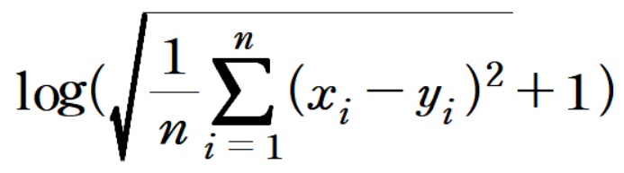

# Forcast Traffic

## Task
```
이전 기간동안 35개 도로의 교통량과, 예측 기간동안 10개 도로의 교통량을 기반으로 25개 도로의 교통량 예측

각 고속도로(전체 35개)의 1시간 단위 교통량 데이터 제공.
 - 10개 고속도로의 교통량 데이터는 전체 기간을 제공하며,
 - 25개 고속도로의 교통량 데이터는 일부 기간만 제공됨.


```

## Dataset
| Phase | # |
| - | - |
| train | 2020.01.01 ~ 05.01 |
| validate | 2020.04.17 ~ 05.16 |
| test | 2020.05.02 ~ 05.31 |

```
참고 : Train Dataset(2020. 01. 01 ~ 05. 01) 중 1일치 데이터(3월 30일)은 기계 오류로 인해 데이터가 수집 되지 않았음
```


## Data Directory
```
\_data
    \_ train.csv
    \_ validate.csv
    \_ test.csv
```

## Data Sample


참고 : 예측 기간 중 25개 도로의 교통량 데이터는 -999로 처리되어있음


## Metric
```
평가를 위한 Metric : RMSE_Custom
```



## Commands
```
# train
python main.py 

# test 
python main.py --batch=4 --model_name="1.pth" --mode="test"


All options in example commands are default value.
```


