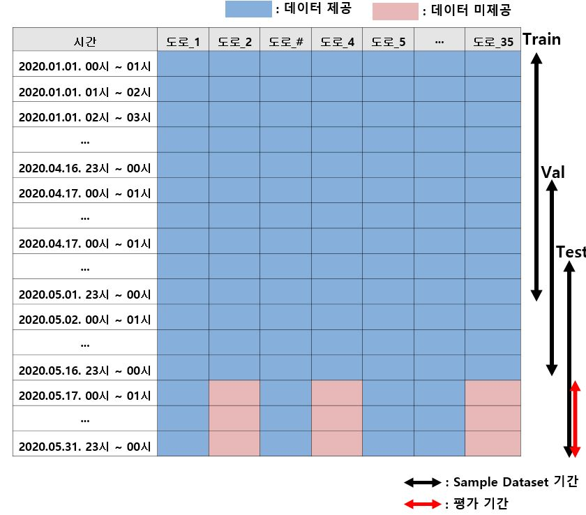
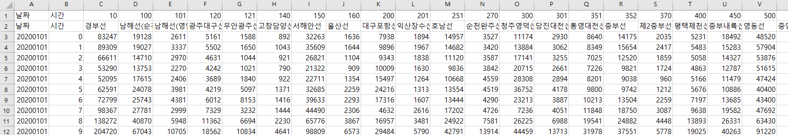
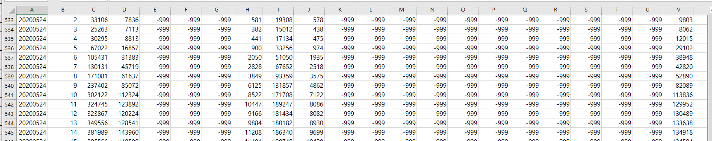
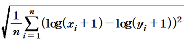

# Forecast Traffic

## Task
```
이전 기간동안 35개 도로의 교통량과, 예측 기간동안 10개 도로의 교통량을 기반으로 25개 도로의 교통량 예측

각 고속도로(전체 35개)의 1시간 단위 교통량 데이터 제공.
 - 10개 고속도로의 교통량 데이터는 전체 기간을 제공
 - 25개 고속도로의 교통량 데이터는 예측기간을 제외한 기간만 제공
```

## Dataset(Sample)
| Phase | # |
| - | - |
| train | 2020.01.01 ~ 05.01 |
| validate | 2020.04.17 ~ 05.16 |
| test | 2020.05.02 ~ 05.31 |




```
****** 제공되는 Dataset은 Sample입니다. ******
- 제공되는 Sample Dataset은 Sequence Data임을 고려하여, 예측기간의 교통량을 예측 할 수 있도록 이전 기간의 데이터가 함께 제공됩니다.
- 이 문제에서는 참가자가 원하는 크기의 Window를 적용 할 수 있도록 Dataset들을 Concat 등으로 연결/조합하는 것이 허용됩니다.
- Evalution()은 예측기간의 Red Cell에 대해서만 평가를 진행합니다.
 (prediction.txt 파일의 최근 15일 예측값에 대해서 Target Value와 매칭하여 Evaluation)

*** 주의점 : Test Dataset을 Concat 등으로 확장하여 사용하는 경우, 사후 검증에서도 재현 될 수 있도록 제출 코드상에 자동화하여 작성 !!! 필수 !!!
            (Admin은 참가자에게 제공되는 Sample Dataset을 기준으로 Dataset 보유)

*** Blue Cell : 제공되는 데이터 / Red Cell : 제공되지 않는 데이터 (-999로 표기됨) ***

*** 참고 : Sample Train Dataset(2020. 01. 01 ~ 05. 01) 중 1일치 데이터(3월 30일)은 기계 오류로 인해 데이터가 수집 되지 않았음 ***
```


## Data Directory
```
\_data
    \_ train.csv
    \_ validate.csv
    \_ test.csv
```

## Data Sample


***참고 : 예측 기간 중 25개 도로의 교통량 데이터는 -999로 처리되어있음***



## Metric
```
평가를 위한 Metric : RMSLE
```



## Commands
```
# train
python main.py 

# test 
python main.py --batch=4 --model_name="1.pth" --mode="test"


All options in example commands are default value.
```


```
!!!!!!!!!!!!!!!!!!!!! 필독!!!!!!!!!!!!!!!!!!!!!!!!!!!
** 컨테이너 내 기본 제공 폴더
- /datasets : read only 폴더 (각 태스크를 위한 데이터셋 제공)
- /tf/notebooks :  read/write 폴더 (참가자가 Wirte 용도로 사용할 폴더)
1. 참가자는 /datasets 폴더에 주어진 데이터셋을 적절한 폴더(/tf/notebooks) 내에 복사/압축해제 등을 진행한 뒤 사용해야합니다.
   예시> Jpyter Notebook 환경에서 압축 해제 예시 : !bash -c "unzip /datasets/objstrgzip/18_NLP_comments.zip -d /tf/notebooks/
   예시> Terminal(Vs Code) 환경에서 압축 해제 예시 : bash -c "unzip /datasets/objstrgzip/18_NLP_comments.zip -d /tf/notebooks/
   
2. 참가자는 각 문제별로 데이터를 로드하기 위해 적절한 path를 코드에 입력해야합니다. (main.py 참조)
3. 참가자는 모델의 결과 파일(Ex> prediction.txt)을 write가 가능한 폴더에 저장되도록 적절 한 path를 입력해야합니다. (main.py 참조)
4. 세션/컨테이너 등 재시작시 위에 명시된 폴더(datasets, notebooks) 외에는 삭제될 수 있으니 
   참가자는 적절한 폴더에 Dataset, Source code, 결과 파일 등을 저장한 뒤 활용해야합니다.
   
!!!!!!!!!!!!!!!!!!!!! 필독!!!!!!!!!!!!!!!!!!!!!!!!!!!
```
