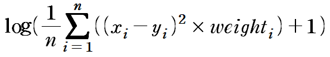

# Classification_COVID

## Task
```
태양관측위성으로 수집되는 데이터를 바탕으로 태양입자유입(Proton Flux) 양상 예측 문제

Input : SWE, EPM, X-ray 
Output : Proton
```
## Description
```
- 태양의 플레어, 코로나 등에 의해 고에너지 입자가 방출되며, 1시간 ~ 수일 이내에 지구에 도달
- 이 때, X-ray, SWE, EPM 등의 정보를 양성자(Proton Flux)보다 먼저 관측 할 수 있음
- 지구에 피해를 줄 우려가 있는 요소는 양성자(Proton Flux)임
- 양성자의 Traval Time은 유동적임 
- 각 관측 데이터는 수집 주기(Time Step)가 다름
- Proton :5분 / x-ray : 1분 / SWE : 약 1분 / EPM : 약 5분 
- SWE와 EPM은 수집주기가 다소 변동적임

태양으로부터 관측되는 데이터는 매 사건마다 Traval Time이 다를 수 있어 관측되기 까지의 시간/ 혹은 영향을 주는 기간이 다를 수 있으며, 
각 데이터의 관측 주기도 다르니 참고바랍니다.
```


## Dataset
| Phase | 기간 | Solar Proton Events |
| - | - | - |
| train | 1998/02/04 ~ 2005/09/10 | 88 |
| validate | 2005/09/11 ~ 2012/07/11 | 19 |
| test | 2012/07/12 ~ 2017/12/31 | 20 |

※ 참고 : https://umbra.nascom.nasa.gov/SEP/ (Solar Proton Events Affecting the Earth Environment)


## Data Directory
```
\_data
    \_ train
        \_ 0.png , 1.png, 2.png ..., train_label_COVID.txt and train_label_COVID.xlsx
    \_ validate
        \_ 0.png , 1.png, 2.png ..., validate_label_COVID.txt and validate_label_COVID.xlsx
    \_ test
        \_ 0.png , 1.png, 2.png ..., test_label_COVID.txt and test_label_COVID.xlsx        

```

## Data Sample

이미지로 예시

## Label Sample


이미지로 예시


## Metric
```
평가를 위한 Metric : RMSE(Custom)
weight : proton Time Step 기준으로 전체 데이터수/해당 등급 데이터 수
```


| Proton Value | Weight |
| - | - |
| 0 ~ 10 | 1 | 
| 10 ~ 100 | 68 |
| 100 ~ 1000 | 182 |
| 1000 ~ 10000 | 809 |
| 10000 ~ | 6041 |

## Commands
```
# train
python main.py 

# test (for submission)
python main.py --batch=4 --model_name="1.pth" --mode="test" --model_name 1.pth

모든 옵션은 default value가 있음
옵션은 main.py 파일 참고
```
