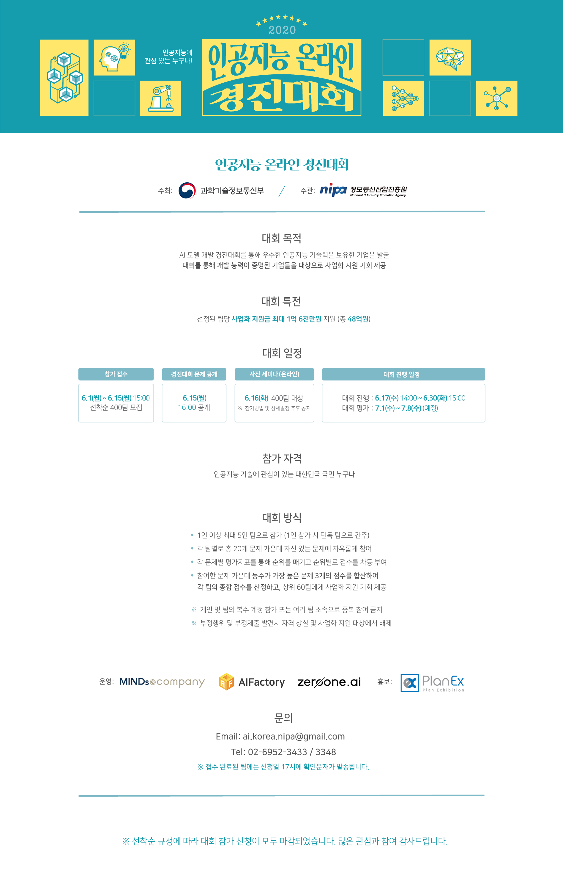

# AI-Challenge2020

 

## Description
```
본 Repository는 2020년 인공지능 온라인 경진대회를 위한 페이지입니다.
대회에서 제시하는 20개 문제의 Task, Data 등에 대한 설명과 Pytorch로 작성된 Base Line Code을 제공합니다.
```

## 대회 공지사항 및 Q&A
```
공지사항 확인 및 Q&A는 아래 주소를 활용하시기 바랍니다.

http://aichallenge.or.kr/community/search.do?mode=notice
```
